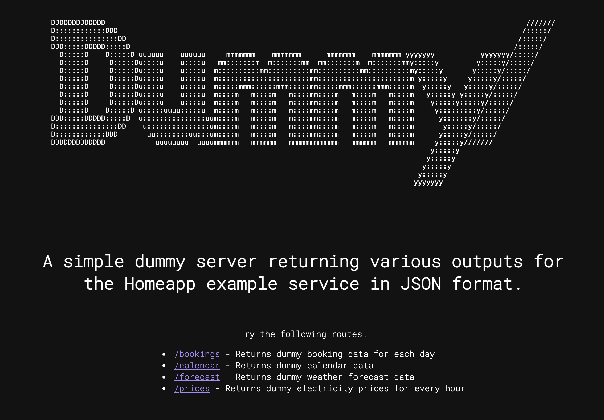

# Dummy JSON service

Dummy JSON backend service built with Bun. Return various datasets for the Homeapp.

This repo was built to experiment with Bun.js and have a fun JSON service that can be used to serve the other project Homeapp.

To get started, download this repo and run in your terminal:

```bash
bun install
bun run dummy
```

This project was created using `bun init` in bun v1.1.4. [Bun](https://bun.sh) is a fast all-in-one JavaScript runtime.


